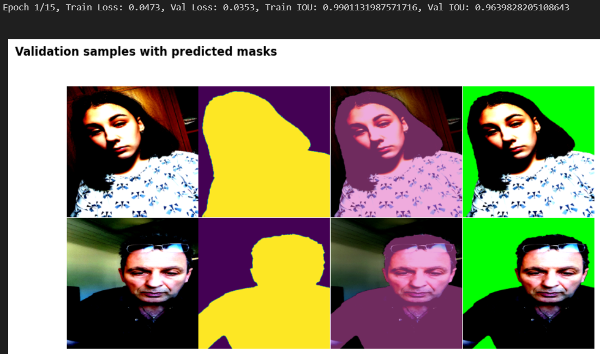
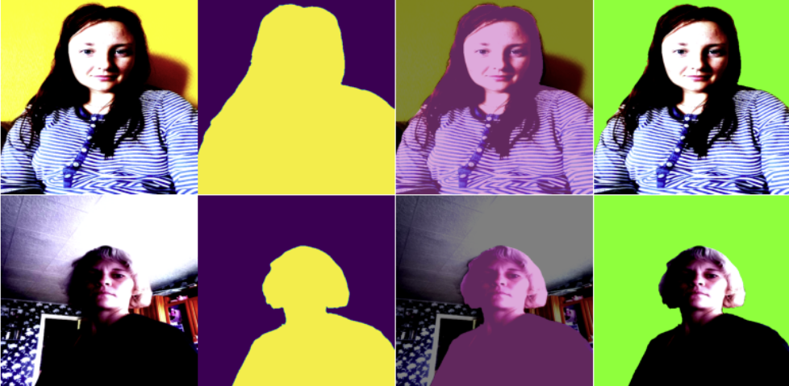
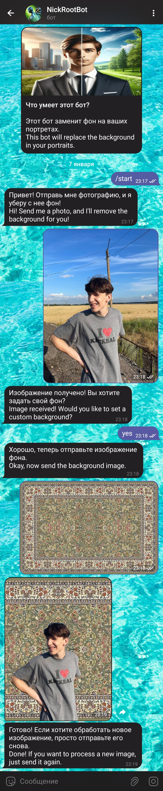

# Portrait Segmentation Project

This project focuses on creating a model for segmenting people in images using the [EasyPortrait: Face Parsing & Portrait Segmentation](https://www.kaggle.com/datasets/kapitanov/easyportrait) dataset. It utilizes PyTorch, Albumentations, and the Segmentation Models PyTorch (SMP) library for model development and training. A Telegram bot, [NickRoot_Bot](https://t.me/NickRoot_Bot), has been created based on the trained model.

## Contents

1. [Project Structure](#project-structure)
2. [Dataset Structure](#dataset-structure)
3. [Dependencies](#dependencies)
4. [Setup and Installation](#setup-and-installation)
5. [Model Overview](#model-overview)
6. [Training Pipeline](#training-pipeline)
7. [Visualization](#visualization)
8. [Testing](#testing)
9. [Telegram Bot for Background Removal](#telegram-bot-for-background-removal)
10. [Features](#features)
11. [Example Interaction with the Bot](#example-interaction-with-the-bot)
12. [Installation](#installation)
13. [Usage](#usage)
14. [Code Overview](#code-overview)
15. [Dependencies for the Telegram Bot](#dependencies-for-the-telegram-bot)
16. [Bot Work Visualization](#bot-work-visualization)
17. [License](#license)

---

## Project Structure

```
/background_delete_bot
|-- examples/
|   |-- example.jpg #Bot Work Screenshot
|   |-- test_result.png #Model Predictions on Test Dataset
|   |-- visualization.png #Visualization Screenshot
|
|-- model_training/
|   |-- background_delete_model.ipynb #Model training notebook
|   |-- deeplabplus_mobile0nes4_epoch10_binary.pth #Saved model
|   |-- requirements.txt
|
|-- telegram_bot/
    |-- bot.py #Telegram bot script
    |-- requirements.txt
```

## Dataset Structure

The dataset consists of three main parts:

```
/kaggle/input/easyportrait
|-- images/
|   |-- train/
|   |-- val/
|   |-- test/
|
|-- annotations/
    |-- train/
    |-- val/
    |-- test/
```

- **images/**: Contains training, validation, and test images.
- **annotations/**: Contains masks for each image, where pixels represent:
  - "0" — background,
  - "1" — person,
  - "2" — skin,
  - "3" — left eyebrow,
  - "4" — right eyebrow,
  - "5" — left eye,
  - "6" — right eye,
  - "7" — lips,
  - "8" — teeth.

---

## Dependencies

Before running the project, install the following dependencies:

- Python 3.8+
- PyTorch
- Albumentations
- Segmentation Models PyTorch (SMP)
- OpenCV
- NumPy
- Matplotlib
- tqdm

Install the required libraries using pip:

```bash
pip install -r requirements.txt
```

---

## Setup and Installation

1. Clone or download this project.
2. ```cd model_training```
3. ```pip install -r requirements.txt```
4. Set the `DATA_DIR` variable to the root directory of the [EasyPortrait: Face Parsing & Portrait Segmentation](https://www.kaggle.com/datasets/kapitanov/easyportrait) dataset.

---

## Model Overview

### Architecture

The segmentation model is built using SMP:
- **Decoder:** DeepLabV3+
- **Encoder:** MobileOne (pretrained on ImageNet)

### Loss Function

A combined loss function is used, including:
- Dice Loss
- Cross Entropy Loss

### Optimizer

AdamW optimizer is used with the following parameters:
- learning rate: `1e-4`
- weight decay: `1e-5`

---

## Training Pipeline

### Data Augmentation

Albumentations library is used for augmentations:
- **Training augmentations**: Shifting, scaling, rotation, adding noise, adjusting brightness/contrast, and resizing to 512x512.
- **Validation augmentations**: Resizing to 512x512.

### DataLoader

Separate dataloaders are used for training, validation, and testing. Batch size is 4.

### Training Function

The training function processes the dataset in batches:
- Mixed precision training is implemented using `torch.cuda.amp` for efficiency.
- Metrics: IoU score, Dice score.

---

## Visualization

The `visualize_seg_mask` function is used to:
1. Display the original image.
2. Show the predicted mask.
3. Overlay segmentation results on the original image.
4. Display the background removal result.



---

## Testing



- Test_loss:  0.0367
- Test_IoU:  0.986

---

## Telegram Bot for Background Removal

A Telegram bot is implemented to remove backgrounds from images using the pre-trained model. The bot also allows users to replace the background with a custom image or a default green background.

You can test the bot via this link: [NickRoot_Bot](https://t.me/NickRoot_Bot).

## Features

- **Background Removal**: Removes the background from the uploaded image.
- **Custom Background**: Users can upload their own background image.
- **Default Green Background**: If no custom background is uploaded, the bot replaces the background with a green screen.
- **User-Friendly Interaction**: The bot guides users through the process with simple instructions.

---

## Example Interaction with the Bot

1. The user sends an image to the bot.
2. The bot processes the image using the pre-trained model for background segmentation.
3. The user can choose to upload a custom background or use the default green background.
4. The bot generates the final image and sends it back to the user.

---

## Installation

1. Clone this repository
2. ```cd telegram_bot```
3. ```pip install -r requirements.txt```
4. Set up the Telegram bot token: Replace the `TELEGRAM_TOKEN` variable in `bot.py` with your bot token obtained from [BotFather](https://core.telegram.org/bots#botfather).
5. Place the pre-trained model file: Ensure the model file (`deeplabplus_mobile0nes4_epoch10_binary.pth`) is in the appropriate directory specified in the code.

---

## Usage

1. Run the bot:

   ```bash
   python bot.py
   ```

2. Interact with the bot in Telegram:

   - Send the `/start` command to begin.
   - Upload an image for background removal.
   - Reply "yes" to upload a custom background or "no" to use the default green background.

---

## Code Overview

- **Core Functions**:
  - `process_image`: Processes the uploaded image to remove the background and replace it with the chosen background.
  - `create_green_background`: Generates the default green background.
  - `resize_or_crop_background`: Resizes or crops the custom background to match the input image size.

- **Handlers**:
  - `/start`: Initializes the bot and provides instructions.
  - `handle_photo`: Processes the uploaded image and performs its transformation.
  - `handle_text`: Interprets user responses to determine the use of custom or default background.

## Dependencies for the Telegram Bot

- `torch`: For loading and running the pre-trained DeepLab model.
- `cv2`: For image processing.
- `numpy`: For numerical operations on image arrays.
- `Pillow`: For handling image formats.
- `albumentations`: For data augmentation and transformations.
- `python-telegram-bot`: For integrating with the Telegram Bot API.

---

## Bot Work Visualization



---

## License

This project is open-source.
